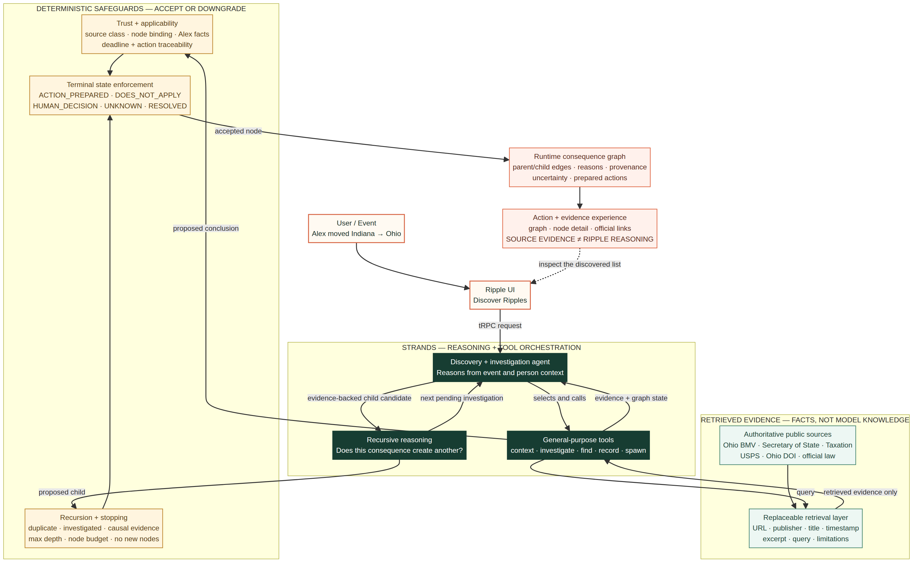

# Ripple

> **Something changed. What else does that change?**

Ripple is a consequence-discovery agent built with the [Strands Agents SDK][1]. Other agents help complete a known to-do list. Ripple discovers important tasks, decisions, and uncertainties that a person did not know belonged on the list.

This competition prototype deliberately demonstrates one synthetic scenario: **Alex Morgan moves from Indianapolis, Indiana, to Columbus, Ohio** on a configurable date. Ripple begins with the move and Alex's declared facts. It uses Strands reasoning and general-purpose tools to discover possible consequences, investigate authoritative evidence, test applicability, recursively follow downstream effects, prepare supported actions, preserve uncertainty, and stop safely.

Ripple does not load a static Ohio consequence tree. The interface starts with no graph and accepts only the graph returned by the live request.

## Problem and Everyday Agents target user

A person experiencing a consequential everyday change often knows the event but not every administrative, civic, financial, or logistical consequence it creates. Ripple is designed for individuals navigating those changes who need help discovering the questions, actions, and decisions they did not know to ask about. This repository proves that concept with one bounded interstate-move demo; it is not a general life-event product or professional-advice service.



## Demo

Open the app, confirm that no graph exists, choose a move date, and select **Discover Ripples**. A successful live run shows investigation progress, then renders the move as the graph root. First-order consequences branch from the move. Evidence-backed second-order consequences branch from their actual parent.

Use the runtime-derived **Judge walkthrough** guide to inspect an action, a recursive child, an intentional `UNKNOWN`, a contextual `DOES_NOT_APPLY`, and the completed graph. The guide selects nodes by their live status and provenance; it does not contain predetermined consequence names.

The complete 3–4 minute script is in [`docs/DEMO_WALKTHROUGH.md`](docs/DEMO_WALKTHROUGH.md).

## Architecture

Ripple separates model reasoning from deterministic safeguards.

| Layer | Responsibility |
| --- | --- |
| **React experience** | Presents the Alex event, invokes Ripple through tRPC, visualizes the runtime graph, and separates source evidence from Ripple reasoning. |
| **Request-scoped bridge** | Runs the Python worker within the web request and propagates structured success or failure. |
| **Strands discovery agent** | Reasons from the event and person context to propose direct consequence investigations. |
| **General Strands tools** | Retrieve context, investigate a domain, detect existing nodes, record conclusions, and spawn evidence-backed child investigations. |
| **Official evidence provider** | Retrieves curated, replaceable records with URL, publisher, title, timestamp, excerpt, query context, structured facts, and limitations. |
| **Deterministic trust layer** | Reclassifies source quality by host, binds evidence to a node, checks Alex-specific facts, traces deadlines, grounds actions, and downgrades unsupported conclusions to `UNKNOWN`. |
| **Recursive graph store** | Enforces causal child evidence, duplicate detection, already-investigated protection, depth, node budget, and no-new-consequences stopping. |
| **Runtime result** | Returns nodes, parent-child edges, statuses, reasons, evidence, model reasoning, uncertainty, prepared actions, tool activity, safeguards, and a run ID. |

The editable diagram source is [`docs/architecture.mmd`](docs/architecture.mmd); the rendered competition asset is [`docs/architecture.png`](docs/architecture.png).

## Where Strands is used

`python/ripple_engine.py` constructs Strands agents with the configured live model provider and exposes general tools to them. Strands is responsible for:

1. discovering consequence candidates from the move and Alex's context;
2. selecting and calling investigation tools;
3. distinguishing retrieved evidence from its own reasoning;
4. deciding applicability and proposing a guarded terminal status;
5. identifying material evidence-backed downstream consequences; and
6. continuing until the pending investigation queue is empty or safeguards stop the run.

Deterministic Python code does **not** supply a final checklist. It validates every proposed graph mutation. That boundary prevents model knowledge from promoting weak evidence, inventing deadlines, reusing evidence from another node, duplicating investigations, or creating unsupported child nodes.

## General tools

| Tool | Purpose |
| --- | --- |
| `get_person_context` | Returns the synthetic event, Alex's declared facts, current graph summary, and pending nodes. |
| `investigate_domain` | Queries the replaceable evidence provider for one or more runtime-selected investigations. |
| `find_existing_node` | Checks normalized graph identity before spawning another investigation. |
| `record_consequence` | Proposes a conclusion, applicability record, prepared action, evidence IDs, reasoning, uncertainty, and optional evidence-backed children. |
| `spawn_investigation` | Adds a novel child only when its cited causal evidence belongs to the parent and supports the relationship. |

## Statuses

Every investigated node ends in exactly one state.

| Status | Meaning |
| --- | --- |
| `RESOLVED` | No outstanding step remains. |
| `DOES_NOT_APPLY` | Trusted evidence defines a trigger and Alex's declared context negates it. |
| `ACTION_PREPARED` | Ripple prepared, but did not execute, an action supported by sufficient node-bound evidence. |
| `HUMAN_DECISION` | Trusted evidence establishes a genuine choice Ripple should not make for Alex. |
| `UNKNOWN` | Evidence, source quality, applicability facts, or orchestration output is insufficient. Ripple stops rather than guesses. |

Ripple never files, pays, changes insurance, submits a government action, or performs another consequential external action.

## Evidence and trust

`python/official_evidence.json` is the active Checkpoint 2 catalog. `python/build_official_catalog.py` reproducibly builds it from `artifacts/cp2-official-source-research.json`. The sources include Ohio BMV, the Ohio Secretary of State, the Ohio Department of Taxation, USPS, the Ohio Department of Insurance, and official Ohio law where relevant.

Source quality is recomputed from the source URL at load time:

| Classification | Meaning |
| --- | --- |
| `PRIMARY_OFFICIAL` | The source host is an allowlisted government agency, official legal publication, or regulator. |
| `AUTHORITATIVE_SECONDARY` | The source is an allowlisted institutional secondary authority. |
| `UNVERIFIED` | The host does not meet the deterministic trust policy. |
| `EVIDENCE_GAP` | No usable source was retrieved. |

A catalog label cannot promote an untrusted host. Legal and administrative `ACTION_PREPARED` conclusions normally require a `PRIMARY_OFFICIAL` source attached to that exact node. A deadline is shown only when its supporting evidence ID is node-bound and the excerpt supports the time window. Otherwise WHEN remains `UNKNOWN`.

## Synthetic demo disclosure

Alex Morgan is fictional. The scenario facts are deliberately limited: Alex has an Indiana driver's license, a personally owned vehicle, auto insurance, an employer, United States citizenship, and voter registration. Alex has no professional license, children, business, or government benefits.

The scenario input itself is labeled synthetic and is never presented as verified public evidence. All public requirements displayed as verified evidence retain source provenance.

## Repository structure

```text
client/src/                         React competition experience
  components/ripple/                Runtime graph, node inspector, demo guide
  lib/ripple-view.ts                Typed view model and runtime-derived demo selection
python/
  ripple_engine.py                  Strands orchestration, tools, graph, safeguards
  official_evidence.json            Active verified-source catalog
  build_official_catalog.py         Reproducible catalog builder
  validate_result.py                14-check live runtime validator
  test_ripple_engine.py             Core recursion and safeguard regressions
  test_trust_layer.py               Evidence/applicability red-team regressions
server/
  ripple.ts                         Request-scoped Node/Python bridge
  routers.ts                        Public tRPC run procedure
  ripple-view.test.ts               Runtime view and presentation regressions
docs/
  architecture.mmd                  Editable architecture diagram
  architecture.png                  Rendered competition architecture asset
  DEMO_WALKTHROUGH.md               Timed judge walkthrough
  JUDGING_ALIGNMENT.md              Criteria-to-feature mapping
artifacts/                           Checkpoint reports and disclosed validation records
Dockerfile                          Node + Python runtime with Strands dependencies
LICENSE                             MIT license
```

## Requirements

- Node.js 22 and pnpm 10
- Python 3.11 or later
- Dependencies in `package.json`, `pnpm-lock.yaml`, and `python/requirements.txt`
- An OpenAI-compatible model gateway that supports tool calls
- `OPENAI_API_BASE` and `OPENAI_API_KEY`, or the managed WebDev Forge endpoint variables used by the request bridge

Do not commit credentials. The repository ignores `.env` files.

## Local setup

Configure the live model gateway in the shell that will run Ripple. Use your own provider values; never commit them:

```bash
export OPENAI_API_BASE="https://your-openai-compatible-endpoint.example"
read -rsp "OPENAI_API_KEY: " OPENAI_API_KEY && export OPENAI_API_KEY && echo
```

The managed WebDev runtime supplies equivalent `BUILT_IN_FORGE_API_URL` and `BUILT_IN_FORGE_API_KEY` variables. Do not copy managed credentials into a public repository. The anonymous Ripple procedure does not require the template's optional OAuth or database integrations.

```bash
git clone <repository-url>
cd ripple-checkpoint-1

pnpm install --frozen-lockfile
sudo uv pip install --system -r python/requirements.txt

pnpm dev
```

Open the local URL printed by the server. The web server invokes the Python worker with a bounded request timeout. The worker uses the configured live model gateway; there is no mock result fallback.

Run the engine directly:

```bash
python3 python/ripple_engine.py \
  --move-date 2026-10-01 \
  --max-depth 3 \
  --max-nodes 14 \
  > runtime-result.json
```

Validate a successful live graph:

```bash
python3 python/validate_result.py runtime-result.json
```

## Tests and build

```bash
python3 python/build_official_catalog.py
pytest -q python/test_ripple_engine.py python/test_trust_layer.py
pnpm check
pnpm test -- --run
pnpm build
```

The Python suite covers runtime graph generation, multiple domains, non-applicability, recursion, duplicate prevention, depth and node budgets, safe stopping, evidence gaps, provenance, wrong-node evidence reuse, unsupported model claims, invented deadlines, weak-source promotion, unsupported children, and malformed tool payload recovery.

The TypeScript/Vitest suite covers the request bridge plus runtime graph summaries, runtime-generation labeling, exact deadline-source binding, exclusion of synthetic input from verified-source counts, parent-child rendering, official links, status treatments, intentional UNKNOWN language, and the runtime-derived judge walkthrough.

## Validation status

The core and trust suites, TypeScript check, production build, and browser layouts pass locally. A prior live Checkpoint 2 Strands graph passed all 14 current runtime validators, but it predates the final source-required applicability and tool-payload hardening. The required fresh exact-code live verification remains blocked because the configured external model gateway returns HTTP 412 `usage exhausted` before producing a graph. Ripple exposes this failure and does not accept an empty or archived graph as a successful run.

This capacity issue is an **open verification gate**, not a product fallback. The app, walkthrough, and repository continue to require the live Strands path.

## Known limitations

Ripple is a bounded hackathon prototype, not legal, tax, insurance, election, or government advice. It covers one synthetic interstate-move scenario. The evidence layer uses curated public-source snapshots rather than live crawling on every run, so sources may change after retrieval. Coverage depends on model discovery and catalog breadth. A single model request can approach the managed runtime timeout. Source allowlists and token-based evidence matching are deterministic but intentionally narrow. `UNKNOWN` is expected when facts or evidence are insufficient. No consequential action is executed.

## AI assistance and pre-existing work disclosure

Manus AI assisted with implementation, research synthesis, testing, interface construction, and documentation under the project owner's direction. All generated and modified code remains subject to human review before public release or submission.

The project began from the Manus full-stack WebDev template, which supplied general-purpose React, Vite, Tailwind, Express, tRPC, authentication, and database scaffolding. Ripple's Strands engine, investigation tools, recursive graph logic, evidence catalog and trust layer, runtime validators, tests, competition experience, architecture diagram, and documentation were created for this project. Authentication and database scaffolding remain unused by the one-user public demo.

Checkpoint 1 established the consequence-discovery engine with controlled synthetic evidence. Checkpoint 2 replaced the active evidence path with curated public sources and added deterministic trust and action guards. Checkpoint 3 created the competition experience and repository materials. Archived checkpoint artifacts are retained for transparent provenance and are not loaded by the active product.

## License

Released under the [MIT License](LICENSE).

## Export or publish manually

Create a source-only ZIP from the committed repository:

```bash
git archive --format=zip --output=../ripple-submission.zip HEAD
```

To publish later, only after the owner approves, authenticate GitHub CLI and push the existing repository to a new public remote:

```bash
gh auth login
gh repo create <github-owner>/ripple --public --source=. --remote=github --push
```

Alternatively, create an empty GitHub repository in the browser and run:

```bash
git remote add github https://github.com/<github-owner>/ripple.git
git push -u github main
```

Review `git status`, `git ls-files`, and the secret scan described in this README before pushing. Do not replace the existing managed `origin` unless the project owner intentionally wants to change it.

## References

[1]: https://strandsagents.com/ "Strands Agents SDK Documentation"
