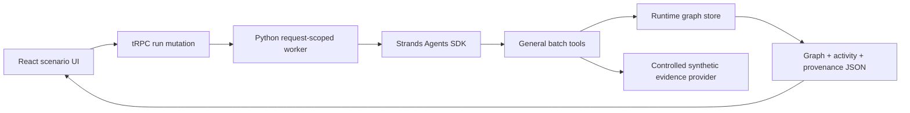

# Ripple — Checkpoint 1

> **Other agents complete your to-do list. Ripple discovers the to-do list you did not know existed.**

This repository implements **Checkpoint 1 only** for the AWS Agents for Humans hackathon. It proves a Strands Agents SDK reasoning loop that starts with Alex Morgan's interstate move, discovers possible consequences at runtime, retrieves controlled synthetic evidence through tools, resolves applicability, recursively creates downstream investigations, and stops under deterministic safeguards.

## Run locally

The managed WebDev environment supplies the model proxy credentials. In another environment, set `OPENAI_API_BASE` and `OPENAI_API_KEY` to an OpenAI-compatible endpoint that supports tool calls.

```bash
pnpm install
sudo uv pip install --system -r python/requirements.txt
pnpm dev
```

Run the engine without the UI:

```bash
python3 python/ripple_engine.py --move-date 2026-10-01 > result.json
python3 python/validate_result.py result.json
```

Run all deterministic tests and build checks:

```bash
cd python && pytest -q test_ripple_engine.py
cd .. && pnpm check && pnpm build && pnpm test
```

## Architecture



The discovery agent sees the move and person context but no consequence checklist. It creates first-order candidates with `find_existing_node` and `spawn_investigation`. A recursive investigator retrieves evidence with `investigate_domain`, records exactly one terminal status through `record_consequence`, and creates children only when retrieved evidence reveals a material prerequisite or downstream consequence. The engine binds every source to the node that retrieved it and coerces conclusions without node-bound evidence to `UNKNOWN`.

## General tools

| Tool | Purpose |
| --- | --- |
| `get_person_context` | Retrieves the synthetic person and event facts. |
| `find_existing_node` | Checks runtime graph identity before creation. |
| `spawn_investigation` | Creates guarded first-order or child investigations. |
| `get_pending_nodes` | Exposes unresolved nodes and the empty-queue stop signal. |
| `get_graph_snapshot` | Lets the investigator review causal structure and statuses. |
| `investigate_domain` | Queries the replaceable evidence provider with open text. |
| `record_consequence` | Records one terminal status with evidence and reasoning separated. |

## Evidence and safeguards

`python/mock_evidence.json` is explicitly labeled controlled mock/synthetic evidence. `MockEvidenceProvider` is the replacement seam for real public sources in a future checkpoint. Every graph node contains `reason`, `model_reasoning`, `evidence`, `parent_id`, `depth`, `discovered_by`, and `spawned_consequences`.

The graph store enforces maximum depth, maximum node count, normalized duplicate detection, already-investigated detection, node-bound evidence, evidence-gap coercion to `UNKNOWN`, and termination when no pending nodes remain.

## Scope

This build includes one user, one interstate-move event, one synthetic evidence catalog, one reasoning workflow, and one minimal web interface. It does not include authentication, email, banking, filings, payments, notifications, additional users or events, production legal data, or AgentCore deployment.
