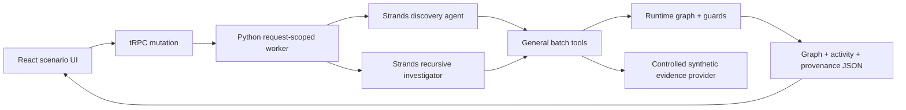

# Ripple — Checkpoint 1 Report

**Author:** Manus AI  
**Scenario:** Alex Morgan moves from Indianapolis, Indiana, to Columbus, Ohio  
**Checkpoint boundary:** Checkpoint 1 only

## Executive conclusion

**Checkpoint 1 passes.** Starting with only the configured move and Alex Morgan's synthetic context, a Python Strands Agents SDK workflow generated a consequence graph at runtime. The workflow discovered multiple consequence domains, resolved a context-negative candidate as `DOES_NOT_APPLY`, followed vehicle-registration evidence into a downstream inspection node, retained uncertainty as `UNKNOWN`, kept retrieved evidence separate from model reasoning, and stopped with no pending consequence nodes.

The final verification combined a live model-driven run with deterministic unit tests. The exact-code run completed in approximately two minutes and produced a passing eight-check validation report. A browser-triggered end-to-end run also reached the Python Strands worker, rendered the graph and provenance views, and displayed live phase activity. The project does not load a prebuilt final graph.

## 1. Architecture

Ripple uses a request-scoped web architecture. The React interface calls a public tRPC mutation. The Node server starts one Python worker for that request. The Python worker creates a fresh runtime graph store, configures Strands against the managed OpenAI-compatible model endpoint, and exposes general-purpose tools to two Strands agents. The discovery agent proposes first-order consequences. The investigator resolves pending nodes and follows evidence-backed downstream effects.

This design keeps model judgment and deterministic enforcement separate. Strands provides the model-driven tool loop described in its Python documentation.[1] The graph store, rather than the model, enforces depth, duplication, evidence binding, terminal-state, and stopping invariants.

## 2. Strands components used

The implementation uses `Agent`, the `@tool` decorator, `OpenAIModel`, tool-call metrics, and per-invocation traces. Strands' OpenAI provider is configured with the managed OpenAI-compatible endpoint and `stream=False`, because the current proxy returns non-streaming tool-call responses. The selected model is `gpt-5-mini`, discovered from the live model catalog rather than assumed from a static list. Strands supports custom Python tools and OpenAI-compatible model endpoints through these components.[2] [3]

Two agents share the same runtime store. The first agent performs direct-consequence discovery. The second agent performs evidence retrieval, applicability resolution, and recursive child discovery. Tools use bounded JSON batches so several nodes can be processed in one model cycle and the web request remains within the managed request limit.

## 3. Tools

| General tool | Responsibility | Deterministic behavior |
| --- | --- | --- |
| `get_person_context` | Retrieves Alex's synthetic attributes and the configured move event. | Returns only the scenario object supplied to the run. |
| `find_existing_node` | Checks candidate identity before graph mutation. | Uses normalized domain-and-title keys. |
| `spawn_investigation` | Creates first-order or child consequence nodes. | Enforces parent existence, topical domain, maximum depth, maximum nodes, duplicate checks, and parent-bound causal evidence for every child. |
| `get_pending_nodes` | Returns unresolved nodes. | An empty result is the no-new-consequences stop signal. |
| `get_graph_snapshot` | Exposes the current graph for coverage and causal review. | Returns current runtime state only. |
| `investigate_domain` | Queries the controlled evidence provider with open text. | Returns node-bound evidence or an explicit evidence-gap record. |
| `record_consequence` | Records one terminal conclusion per node. | Rejects repeated conclusions and coerces unbound or missing evidence to `UNKNOWN`. |

No tool represents a predetermined domain action such as `check_ohio_license`. The tool surface remains event-agnostic and consequence-agnostic.

## 4. Discovery method

The discovery prompt receives only the root event description. It must retrieve person context through a tool. It then proposes a compact set of direct, materially plausible consequences across distinct topical domains. Candidate names and domains are model outputs. They are checked for duplication and then created under the root.

The discovery phase does not query a consequence list, read a saved graph, or inspect the mock evidence catalog. It also does not create procedural prerequisites. That separation matters because it prevents an already-known downstream sequence from being inserted as a root-level checklist item.

## 5. Recursive reasoning method

The investigator repeatedly requests pending nodes. It queries evidence for every pending node through `investigate_domain`, records exactly one terminal status, and inspects retrieved excerpts for a material prerequisite or follow-on effect. When evidence states such an effect, the investigator checks for an existing node and creates a child under the causal consequence.

In the verified graph, the vehicle-registration investigation retrieved evidence stating that an out-of-state vehicle identification inspection is a prerequisite to Ohio title transfer. The agent therefore created **Out-of-state vehicle identification inspection (VIN inspection)** as a depth-two child of the vehicle-registration consequence. This relationship was produced at runtime. The graph store accepted it only because the child cited a source previously retrieved for the parent and the child claim overlapped the source text.

## 6. Stopping conditions

| Safeguard | Enforcement |
| --- | --- |
| Maximum depth | A child whose depth would exceed `max_depth=3` is rejected. |
| Maximum nodes | A run cannot exceed the configured node budget. |
| Duplicate detection | A normalized domain-and-title key maps to at most one node. |
| Already investigated | A node with a terminal status cannot receive a second conclusion. |
| Evidence required | A conclusion without evidence retrieved for that same node becomes `UNKNOWN`. |
| Causal child evidence | Every non-root child must cite evidence retrieved for its parent, and its claim must overlap that source. |
| No new consequences | The investigator stops only after `get_pending_nodes` returns zero. |
| Agent interruption | Any leftover pending node is deterministically closed as `UNKNOWN` with an engine evidence-gap record. |

The final runtime artifact records `NO_NEW_CONSEQUENCES` as the stop reason. The deterministic suite separately proves that maximum-depth rejection works even though the sample graph only needed depth two.

## 7. Avoidance of hard-coded checklist behavior

The code contains no state-specific consequence branching and no prebuilt graph. It does not contain logic equivalent to `if moved_to_ohio: check_license()`. The only fixed scenario data are Alex's attributes and move. The mock catalog contains replaceable evidence documents, not graph nodes or an ordered checklist.

The graph store starts with exactly one node: **Interstate Move: Indiana → Ohio**. Consequence nodes appear only when the Strands discovery agent calls `spawn_investigation`. A unit test verifies that the store contains only the root before runtime mutation and that adding a runtime node changes the resulting graph.

## 8. Generated consequence graph

The preserved final runtime artifact contains the root plus nine model-discovered consequence nodes. The exact graph varies between runs because discovery is model-driven. The verified sample includes the following structure.

| Depth | Consequence | Status | Parent |
| ---: | --- | --- | --- |
| 0 | Interstate Move: Indiana → Ohio | `RESOLVED` | — |
| 1 | Ohio driver's license transfer | `ACTION_NEEDED` | Root move |
| 1 | Ohio vehicle registration and plates | `ACTION_NEEDED` | Root move |
| 1 | Notify auto insurer / update policy and possible premium change | `ACTION_NEEDED` | Root move |
| 1 | Change voter registration to Ohio | `ACTION_NEEDED` | Root move |
| 1 | State residency determination for income tax and withholding | `ACTION_NEEDED` | Root move |
| 1 | USPS mail forwarding setup | `UNKNOWN` | Root move |
| 1 | Professional license transfer or applicability | `DOES_NOT_APPLY` | Root move |
| 1 | Jury duty eligibility and registration in new county | `UNKNOWN` | Root move |
| 2 | Out-of-state vehicle identification inspection (VIN inspection) | `ACTION_NEEDED` | Vehicle registration |

The two `UNKNOWN` nodes demonstrate conservative failure behavior. The controlled catalog contains no USPS or jury-service source, so Ripple retained explicit evidence-gap records rather than inferring requirements from unrelated address or civic sources.

## 9. Evidence and provenance structure

Each node stores `id`, `title`, `domain`, `parent_id`, `depth`, `status`, `reason`, `evidence`, `discovered_by`, `spawned_consequences`, `why_investigated`, and `model_reasoning`. Evidence records contain `source_id`, `source_type`, `publisher`, `title`, `excerpt`, `retrieved_at`, `query`, and a `synthetic` flag.

Retrieved evidence and model reasoning are separate fields. The graph store tracks which source identifiers were retrieved for each node. A model cannot reuse a source retrieved for one node to support another node. A dedicated regression test verifies that attempted cross-node reuse is converted to `UNKNOWN`.

All Checkpoint 1 source records are labeled **CONTROLLED MOCK/SYNTHETIC EVIDENCE**. `EvidenceProvider` is an interface. `MockEvidenceProvider` is its current implementation. A later checkpoint can replace it with verified public-source retrieval without changing the graph or tool contracts.

## 10. Test results

| Verification | Result | Evidence |
| --- | --- | --- |
| Python unit suite | **Pass** | 11 tests passed. |
| TypeScript type check | **Pass** | `tsc --noEmit`. |
| Production web build | **Pass** | Vite and esbuild completed. |
| Vitest server suite | **Pass** | 1 test passed. |
| Live runtime validator | **Pass** | All 8 required checks passed. |
| Browser click-through | **Pass** | Run button reached the live server mutation and displayed investigation phases. |
| Visual desktop inspection | **Pass** | Scenario, empty graph, running state, and two-column layout rendered correctly. |

The eight acceptance checks cover multi-domain discovery, `DOES_NOT_APPLY`, downstream recursion, duplicate prevention, depth and stopping safeguards, missing-evidence handling, provenance completeness, and runtime graph generation. Duplicate and maximum-depth behavior are tested deterministically because the successful sample run did not need to trigger those guards.

## 11. Known limitations

The evidence layer is synthetic and must not be treated as legal or administrative guidance. The lexical retriever is deliberately small. It does not perform semantic search or source verification. Model discovery is nondeterministic, so titles and breadth vary between runs. Deterministic guards constrain unsafe outcomes, but they do not prove that every materially relevant consequence was found.

A run currently takes approximately one to three minutes. The interface shows phase-level activity while the request is active and the complete tool activity trace afterward; it does not stream individual tool events from the Python process to the browser. The Node server starts a Python process per run. That approach is appropriate for this checkpoint but is not the intended production execution architecture.

AgentCore deployment, live government sources, authentication, persistence, notifications, external actions, and additional users or life events are intentionally absent. No Checkpoint 2 work was started.

## 12. Files and components created

| Path | Purpose |
| --- | --- |
| `python/ripple_engine.py` | Strands orchestration, runtime graph, tools, evidence guards, and CLI. |
| `python/mock_evidence.json` | Controlled synthetic evidence catalog. |
| `python/test_ripple_engine.py` | Deterministic graph, guard, state, provenance, and runtime tests. |
| `python/validate_result.py` | Eight-check live graph validator. |
| `python/requirements.txt` | Python and Strands dependencies. |
| `server/ripple.ts` | Request-scoped Python worker bridge. |
| `server/routers.ts` | Public typed `ripple.run` mutation. |
| `client/src/pages/Home.tsx` | Scenario, live activity, graph, node inspector, and trace interface. |
| `client/src/index.css` | Ripple visual tokens and typography. |
| `client/index.html` | Metadata and fonts. |
| `Dockerfile` | Deployment image with Node, Python, and Strands. |
| `README.md` | Setup and architecture documentation. |
| `artifacts/checkpoint1-runtime-graph.json` | Preserved runtime-generated graph. |
| `artifacts/checkpoint1-validation.json` | Preserved acceptance-check report. |

## 13. Pass determination

**Checkpoint 1 fully passes the requested pass condition.** The starting inputs are Alex's move and person context. Strands performs actual reasoning and tool orchestration. The graph is generated at runtime. At least one downstream consequence is created recursively. Evidence and uncertainty are retained. Duplicate, depth, already-investigated, node-budget, evidence, and stopping safeguards are implemented and tested. The system terminates without a hard-coded final checklist.

No failure is being hidden. The known limitations above remain outside the Checkpoint 1 pass condition or are explicitly acceptable for the controlled-evidence checkpoint.

## References

[1]: https://strandsagents.com/docs/user-guide/quickstart/python/ "Strands Agents SDK Python Quickstart"
[2]: https://strandsagents.com/docs/user-guide/concepts/tools/python-tools/ "Strands Agents SDK Creating Custom Tools"
[3]: https://strandsagents.com/docs/user-guide/concepts/model-providers/openai/ "Strands Agents SDK OpenAI Model Provider"
